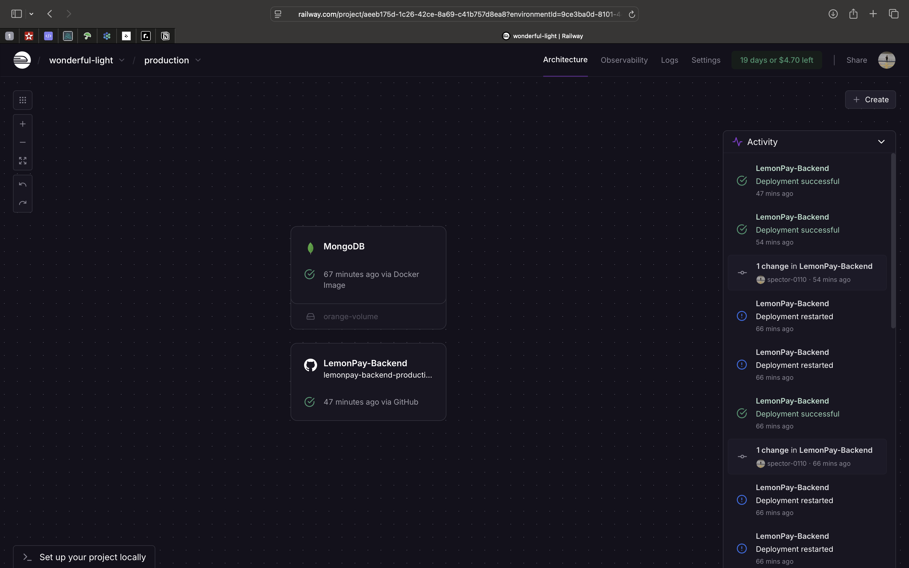

# LemonPay Frontend

A modern, feature-rich payment and task management application built with Next.js 15 and React 19, designed for seamless task tracking and management.


## 🎯 Core Features

### 1. Authentication System
- Secure login and signup functionality
- Password strength validation with regex patterns
- JWT-based authentication with HTTP-only cookies
- Protected routes and API endpoints
- Form validation using Zod schema

### 2. Task Management Dashboard
- **Task Overview**:
  - Comprehensive task listing and organization
  - Real-time task status updates
  - Multiple task statuses (Pending, In Progress, Completed)
  - Task filtering and search capabilities

- **Task Operations**:
  - Create new tasks with detailed information
  - Edit existing task details
  - Delete tasks with confirmation dialog
  - Task status toggling
  - Due date and time management

- **Task Categories**:
  - Overdue task highlighting
  - Due today task indicators
  - Task prioritization

### 3. User Interface
- **Responsive Design**:
  - Mobile-first approach
  - Tablet and desktop optimized layouts
  - Custom mobile detection hooks
  - Adaptive UI based on screen size

- **Modern UI Components**:
  - Animated task cards using Framer Motion
  - Floating action buttons for key actions
  - Modal dialogs for task operations
  - Confirmation dialogs for critical actions
  - Toast notifications for user feedback
  - Custom button components
  - Theme toggle with light/dark mode

### 4. Data Management
- **API Integration**:
  - RESTful API communication
  - Secure token management
  - Error handling with validation
  - Request/response interceptors
  - Automatic token refresh

### 5. Search and Filtering
- Advanced task filtering system
- Real-time search functionality
- Multiple filter categories
- Combined search and filter operations

### 6. State Management
- Efficient React state management
- Real-time UI updates
- Optimistic updates for better UX
- Error state handling

### 7. Performance Optimizations
- Dynamic imports for better loading
- Optimized animations
- Efficient re-rendering
- Image optimization with Next.js

### 8. Development Approach

This project was developed following these key principles and practices:

- **Component-First Development**:
  - Built reusable UI components before page layouts
  - Focused on component modularity and reusability
  - Implemented comprehensive prop validation
  - Created a consistent component API design

- **Agile Methodology**:
  - Iterative development approach
  - Continuous integration and deployment
  - Feature-based branching strategy

- **Performance-First Mindset**:
  - Optimization of bundle sizes
  - Lazy loading of components and routes
  - Image optimization

- **User-Centric Design**:
  - Mobile-first responsive design
  - User feedback integration
  - Intuitive user interface patterns


## 🚀 Quick Start

1. **Clone the repository**
   ```bash
   git clone <repository-url>
   cd frontend
   ```

2. **Install dependencies**
   ```bash
   npm install
   # or
   yarn install
   # or
   pnpm install
   ```

3. **Start the development server**
   ```bash
   npm run dev
   # or
   yarn dev
   # or
   pnpm dev
   ```

4. Open [http://localhost:3000](http://localhost:3000) with your browser to see the result.

## 🛠️ Tech Stack

- **Framework**: Next.js 15.3.4
- **UI Library**: React 19.0.0
- **Styling**: 
  - Tailwind CSS 4.x
  - @headlessui/react for accessible components
  - next-themes for theme management
- **Form Management**: 
  - react-hook-form
  - zod for validation
- **Animations**: framer-motion
- **Icons**: lucide-react
- **Date Handling**: luxon
- **State Management**: React Hooks
- **Development Tools**:
  - ESLint for code quality
  - TurboPack for fast builds
  - PostCSS for CSS processing

## 📁 Project Structure

```
src/
├── app/                # Next.js 13+ app directory
│   ├── dashboard/     # Dashboard pages
│   └── globals.css    # Global styles
├── components/        # Reusable components
│   ├── layout/       # Layout components
│   ├── tasks/        # Task-related components
│   └── ui/           # UI components
├── hooks/            # Custom React hooks
└── lib/             # Utility functions and API
```

## 🔧 Configuration

- **next.config.mjs**: Next.js configuration
- **tailwind.config.js**: Tailwind CSS configuration
- **postcss.config.mjs**: PostCSS configuration
- **eslint.config.mjs**: ESLint configuration

## 🚥 Available Scripts

- `npm run dev` - Start development server with TurboPack
- `npm run build` - Create production build
- `npm run start` - Start production server
- `npm run lint` - Run ESLint checks

## 🌐 Environment Variables

Create a `.env.local` file in the root directory:

```env
NEXT_PUBLIC_API_URL=your_api_url
```

## 🔐 Security

- Implements secure authentication patterns
- Uses secure HTTP-only cookies
- Protected API routes with middleware
- Input validation using zod

## 📱 Browser Support

- Chrome (latest)
- Firefox (latest)
- Safari (latest)
- Edge (latest)

## 🚀 Deployment

The application is optimized for deployment on Vercel:

1. Push your code to GitHub
2. Import your repository to Vercel
3. Configure environment variables
4. Deploy!

For other platforms, ensure you:
1. Build the application (`npm run build`)
2. Start the production server (`npm run start`)

## 📸 Screenshots

Here's a visual overview of the application:

### Demonstration Video
<video width="100%" controls>
  <source src="screenshots/demo.mp4" type="video/mp4">
  Your browser does not support the video tag.
</video>

### Backend Overview


## 🤝 Contributing

1. Fork the Project
2. Create your Feature Branch (`git checkout -b feature/AmazingFeature`)
3. Commit your Changes (`git commit -m 'Add some AmazingFeature'`)
4. Push to the Branch (`git push origin feature/AmazingFeature`)
5. Open a Pull Request


